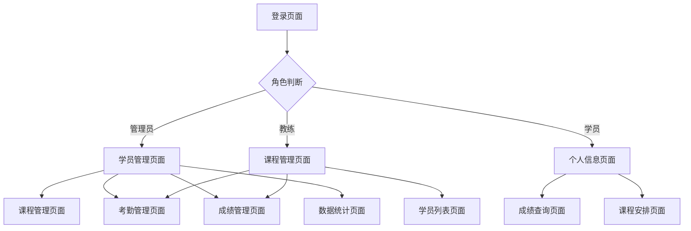

## 1. 产品概述
体育运动学员管理系统是一个专为体育培训机构设计的学员信息管理平台。系统旨在简化学员管理流程，提高教练工作效率，实现学员信息、课程安排、考勤记录和成绩统计的数字化管理。

适用于各类体育培训机构、学校体育部门，帮助管理员和教练高效管理学员信息，跟踪训练进度，生成统计报表。

## 2. 核心功能

### 2.1 用户角色
| 角色 | 注册方式 | 核心权限 |
|------|----------|----------|
| 管理员 | 系统预设账号 | 管理所有学员、课程、教练信息，系统设置 |
| 教练 | 管理员分配账号 | 管理所负责学员，录入考勤和成绩，查看统计 |
| 学员 | 自主注册或管理员添加 | 查看个人信息、课程安排、成绩记录 |

### 2.2 功能模块
系统包含以下主要页面：
1. **登录页面**：用户身份验证，角色权限控制
2. **学员管理页面**：学员信息录入、查询、编辑、删除
3. **课程管理页面**：课程设置、训练计划制定、课程安排
4. **考勤管理页面**：日常考勤记录、请假管理、考勤统计
5. **成绩管理页面**：成绩录入、成绩查询、成绩分析
6. **数据统计页面**：学员统计、课程统计、成绩报表
7. **数据导出页面**：各类数据导出Excel功能

### 2.3 页面详情
| 页面名称 | 模块名称 | 功能描述 |
|----------|----------|----------|
| 登录页面 | 身份验证 | 输入用户名密码进行登录，支持角色权限验证 |
| 学员管理 | 学员列表 | 显示学员基本信息列表，支持搜索、筛选、分页 |
| 学员管理 | 学员录入 | 添加新学员信息，包括姓名、性别、年龄、联系方式等 |
| 学员管理 | 学员编辑 | 修改学员基本信息，支持批量操作 |
| 课程管理 | 课程列表 | 显示所有课程信息，包括课程名称、教练、时间安排 |
| 课程管理 | 课程添加 | 创建新的训练课程，设置课程详情和训练计划 |
| 课程管理 | 课程安排 | 为学员分配课程，制定个人训练计划 |
| 考勤管理 | 考勤录入 | 记录学员每日出勤情况，支持批量考勤 |
| 考勤管理 | 请假管理 | 处理学员请假申请，记录请假原因和时间 |
| 考勤管理 | 考勤统计 | 按时间段统计学员出勤率，生成考勤报表 |
| 成绩管理 | 成绩录入 | 录入学员各项测试成绩，支持多种成绩类型 |
| 成绩管理 | 成绩查询 | 按学员、课程、时间等条件查询历史成绩 |
| 成绩管理 | 成绩分析 | 分析学员成绩趋势，生成进步曲线图 |
| 数据统计 | 学员统计 | 统计学员总数、新增学员、活跃学员等 |
| 数据统计 | 课程统计 | 统计课程开设情况、学员参与度等 |
| 数据导出 | 数据导出 | 支持导出学员信息、考勤记录、成绩数据到Excel |

## 3. 核心流程

### 管理员流程
管理员登录系统后，可以进行学员信息管理、课程设置、数据统计等操作。首先录入学员基本信息，然后设置训练课程和计划，日常进行考勤和成绩记录，最后可以生成各类统计报表。

### 教练流程
教练登录后，主要负责所带学员的日常管理。查看学员信息和课程安排，进行日常考勤记录，录入训练成绩，查看学员进步情况。

### 学员流程
学员登录后可以查看个人信息、课程安排、历史成绩等，了解自己的训练进度和表现。

## 4. 用户界面设计

### 4.1 设计风格
- **主色调**：蓝色系（#409EFF），体现专业性和活力
- **辅助色**：绿色（#67C23A）表示成功，红色（#F56C6C）表示警告
- **按钮样式**：圆角矩形，使用Element Plus默认样式
- **字体**：默认使用系统字体，主要文字14px，标题16-18px
- **布局风格**：左侧导航菜单 + 右侧内容区域的经典后台布局
- **图标风格**：使用Element Plus内置图标，简洁明了

### 4.2 页面设计概览
| 页面名称 | 模块名称 | UI元素 |
|----------|----------|--------|
| 登录页面 | 登录表单 | 居中卡片布局，蓝色渐变背景，包含用户名密码输入框和登录按钮 |
| 学员管理 | 学员列表 | 表格形式展示学员信息，顶部搜索栏，操作按钮放在每行末尾 |
| 课程管理 | 课程列表 | 卡片式布局显示课程信息，包含课程名称、时间、教练信息 |
| 考勤管理 | 考勤录入 | 日期选择器 + 学员列表，支持快速标记出勤状态 |
| 成绩管理 | 成绩录入 | 表单形式录入成绩，支持选择学员、课程和成绩类型 |
| 数据统计 | 数据报表 | 图表展示统计数据，包括饼图、柱状图、折线图等 |

### 4.3 响应式设计
采用桌面端优先设计，适配主流浏览器。在平板和手机上能够正常访问，但主要使用场景为PC端管理操作。

### 4.4 交互优化
- 表单验证：实时验证输入内容，给出明确错误提示
- 操作反馈：增删改操作后显示成功/失败提示
- 加载状态：数据加载时显示加载动画
- 确认对话框：删除等重要操作前需要二次确认