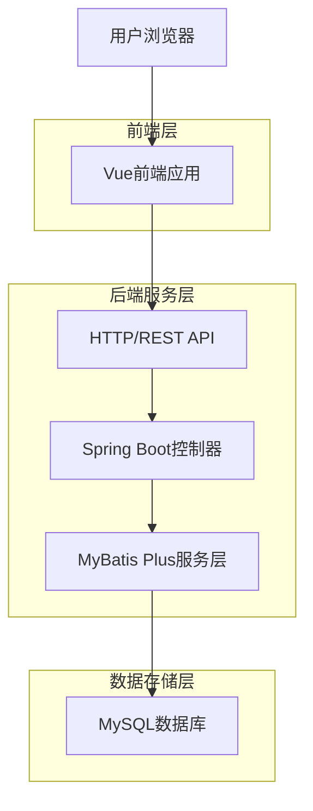
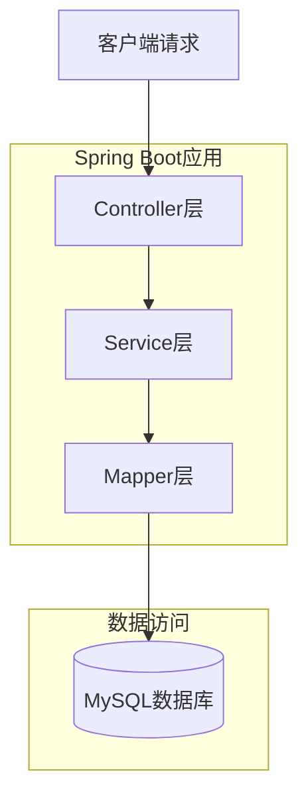
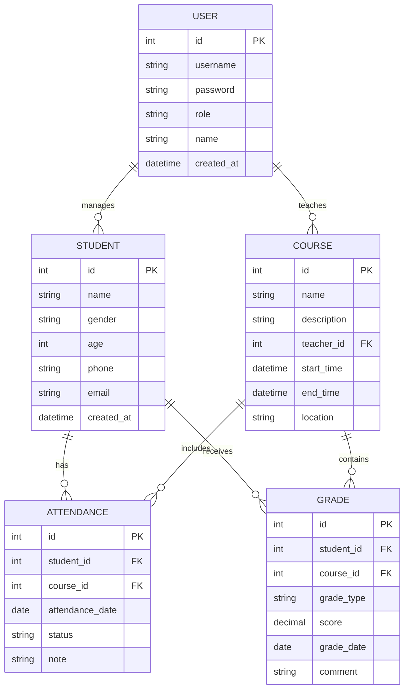

## 1. 架构设计



## 2. 技术栈描述

* **前端**: Vue\@3 + Element Plus + Vite

* **初始化工具**: Vite

* **后端**: Spring Boot\@2.7 + MyBatis Plus + MySQL\@8.0

* **构建工具**: Maven

* **项目结构**: Monorepo架构，前端代码在`/src/frontend`，后端代码在`/src/backend`

## 3. 路由定义

| 路由          | 用途                |
| ----------- | ----------------- |
| /login      | 登录页面，用户身份验证       |
| /dashboard  | 系统首页，显示统计概览       |
| /students   | 学员管理页面，学员信息CRUD操作 |
| /courses    | 课程管理页面，课程设置和安排    |
| /attendance | 考勤管理页面，日常考勤记录     |
| /grades     | 成绩管理页面，成绩录入和查询    |
| /statistics | 数据统计页面，各类统计报表     |
| /export     | 数据导出页面，Excel文件导出  |

## 4. API定义

### 4.1 用户认证相关

```
POST /api/auth/login
```

请求参数：

| 参数名      | 参数类型   | 是否必需 | 描述     |
| -------- | ------ | ---- | ------ |
| username | string | true | 用户名    |
| password | string | true | 密码（明文） |

响应参数：

| 参数名      | 参数类型   | 描述    |
| -------- | ------ | ----- |
| token    | string | JWT令牌 |
| role     | string | 用户角色  |
| username | string | 用户名   |

示例：

```json
{
  "username": "admin",
  "password": "123456"
}
```

### 4.2 学员管理相关

```
GET /api/students?page=1&size=10
POST /api/students
PUT /api/students/{id}
DELETE /api/students/{id}
```

### 4.3 课程管理相关

```
GET /api/courses
POST /api/courses
PUT /api/courses/{id}
DELETE /api/courses/{id}
```

### 4.4 考勤管理相关

```
GET /api/attendance?date=2024-01-01
POST /api/attendance
PUT /api/attendance/{id}
```

### 4.5 成绩管理相关

```
GET /api/grades?studentId=1
POST /api/grades
PUT /api/grades/{id}
DELETE /api/grades/{id}
```

### 4.6 数据导出相关

```
GET /api/export/students
GET /api/export/attendance
GET /api/export/grades
```

## 5. 服务器架构图



## 6. 数据模型

### 6.1 数据模型定义



### 6.2 数据定义语言

用户表（users）

```sql
CREATE TABLE users (
    id INT PRIMARY KEY AUTO_INCREMENT,
    username VARCHAR(50) UNIQUE NOT NULL,
    password VARCHAR(255) NOT NULL,
    role VARCHAR(20) NOT NULL DEFAULT 'student',
    name VARCHAR(100) NOT NULL,
    created_at TIMESTAMP DEFAULT CURRENT_TIMESTAMP,
    updated_at TIMESTAMP DEFAULT CURRENT_TIMESTAMP ON UPDATE CURRENT_TIMESTAMP
);

-- 初始化管理员数据
INSERT INTO users (username, password, role, name) VALUES 
('admin', '$2a$10$N.zmdr9k7uOCQb376NoUnuTJ8iAt6Z5EHsM8lE9lBaUKk7h.T0mUO', 'admin', '管理员');
```

学员表（students）

```sql
CREATE TABLE students (
    id INT PRIMARY KEY AUTO_INCREMENT,
    name VARCHAR(100) NOT NULL,
    gender VARCHAR(10) NOT NULL,
    age INT,
    phone VARCHAR(20),
    email VARCHAR(100),
    address VARCHAR(255),
    emergency_contact VARCHAR(100),
    emergency_phone VARCHAR(20),
    created_at TIMESTAMP DEFAULT CURRENT_TIMESTAMP,
    updated_at TIMESTAMP DEFAULT CURRENT_TIMESTAMP ON UPDATE CURRENT_TIMESTAMP
);

-- 创建索引
CREATE INDEX idx_student_name ON students(name);
CREATE INDEX idx_student_phone ON students(phone);
```

课程表（courses）

```sql
CREATE TABLE courses (
    id INT PRIMARY KEY AUTO_INCREMENT,
    name VARCHAR(100) NOT NULL,
    description TEXT,
    teacher_id INT,
    start_time TIME,
    end_time TIME,
    days_of_week VARCHAR(50),
    location VARCHAR(100),
    max_students INT DEFAULT 30,
    status VARCHAR(20) DEFAULT 'active',
    created_at TIMESTAMP DEFAULT CURRENT_TIMESTAMP,
    updated_at TIMESTAMP DEFAULT CURRENT_TIMESTAMP ON UPDATE CURRENT_TIMESTAMP,
    FOREIGN KEY (teacher_id) REFERENCES users(id)
);
```

考勤表（attendance）

```sql
CREATE TABLE attendance (
    id INT PRIMARY KEY AUTO_INCREMENT,
    student_id INT NOT NULL,
    course_id INT NOT NULL,
    attendance_date DATE NOT NULL,
    status VARCHAR(20) NOT NULL DEFAULT 'present',
    note VARCHAR(255),
    created_at TIMESTAMP DEFAULT CURRENT_TIMESTAMP,
    FOREIGN KEY (student_id) REFERENCES students(id),
    FOREIGN KEY (course_id) REFERENCES courses(id),
    UNIQUE KEY unique_attendance (student_id, course_id, attendance_date)
);

-- 创建索引
CREATE INDEX idx_attendance_date ON attendance(attendance_date);
CREATE INDEX idx_attendance_student ON attendance(student_id);
```

成绩表（grades）

```sql
CREATE TABLE grades (
    id INT PRIMARY KEY AUTO_INCREMENT,
    student_id INT NOT NULL,
    course_id INT NOT NULL,
    grade_type VARCHAR(50) NOT NULL,
    score DECIMAL(5,2) NOT NULL,
    max_score DECIMAL(5,2) DEFAULT 100,
    grade_date DATE NOT NULL,
    comment TEXT,
    created_at TIMESTAMP DEFAULT CURRENT_TIMESTAMP,
    FOREIGN KEY (student_id) REFERENCES students(id),
    FOREIGN KEY (course_id) REFERENCES courses(id)
);

-- 创建索引
CREATE INDEX idx_grades_student ON grades(student_id);
CREATE INDEX idx_grades_course ON grades(course_id);
CREATE INDEX idx_grades_date ON grades(grade_date);
```

### 6.3 项目目录结构

```
sports-management-system/
├── src/
│   ├── frontend/                 # Vue前端项目
│   │   ├── public/
│   │   ├── src/
│   │   │   ├── api/             # API接口定义
│   │   │   ├── components/      # 公共组件
│   │   │   ├── views/           # 页面组件
│   │   │   ├── router/          # 路由配置
│   │   │   ├── store/           # 状态管理
│   │   │   ├── utils/           # 工具函数
│   │   │   └── main.js          # 入口文件
│   │   ├── package.json
│   │   └── vite.config.js
│   │
│   └── backend/                  # Spring Boot后端项目
│       ├── src/main/java/
│       │   ├── controller/      # 控制器层
│       │   ├── service/         # 服务层
│       │   ├── mapper/          # 数据访问层
│       │   ├── entity/          # 实体类
│       │   ├── dto/             # 数据传输对象
│       │   └── config/          # 配置类
│       ├── src/main/resources/
│       │   ├── mapper/          # MyBatis映射文件
│       │   ├── application.yml  # 配置文件
│       │   └── sql/             # SQL脚本
│       └── pom.xml
│
├── .gitignore
└── README.md
```

